# 观察池系统优化方案

## 一、优化总览

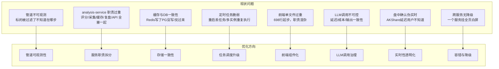

---

## 二、优化后目标架构

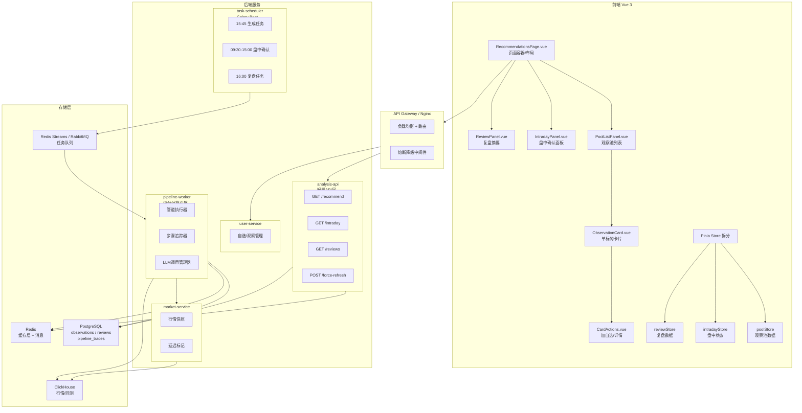

---

## 三、管道可观测性改造

### 3.1 管道追踪模型

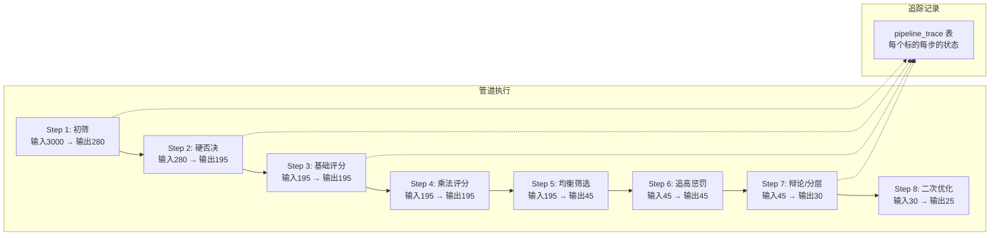

### 3.2 数据库新增表

```python
# backend/shared/models.py — 新增

class PipelineExecution(Base):
    """管道执行记录 - 每次跑管道记一条"""
    __tablename__ = "pipeline_executions"

    id = Column(String, primary_key=True, default=lambda: str(uuid4()))
    execution_date = Column(Date, nullable=False, index=True)
    trigger_type = Column(String(20))  # scheduled / force_refresh / manual
    started_at = Column(DateTime(timezone=True))
    finished_at = Column(DateTime(timezone=True))
    status = Column(String(20))  # running / completed / failed / partial

    # 管道概要
    total_input = Column(Integer)       # 全市场标的数
    total_output = Column(Integer)      # 最终入池数
    step_summary = Column(JSON)         # {"screen": 280, "veto": 195, ...}
    error_message = Column(Text, nullable=True)

    # 关联
    traces = relationship("PipelineTrace", back_populates="execution")


class PipelineTrace(Base):
    """管道追踪 - 每个标的在每步的状态"""
    __tablename__ = "pipeline_traces"

    id = Column(String, primary_key=True, default=lambda: str(uuid4()))
    execution_id = Column(String, ForeignKey("pipeline_executions.id"), index=True)
    stock_code = Column(String(10), index=True)
    stock_name = Column(String(50))

    step_name = Column(String(50))       # screen / veto / base_score / multiply / ...
    step_order = Column(Integer)
    action = Column(String(20))          # passed / filtered / scored / promoted / demoted

    # 每步产生的数据
    score_before = Column(Float, nullable=True)
    score_after = Column(Float, nullable=True)
    reason = Column(String(500))         # "量价异动: 量比3.2, 涨幅2.1%"
    detail = Column(JSON, nullable=True) # 任意结构化数据

    created_at = Column(DateTime(timezone=True), server_default=func.now())

    execution = relationship("PipelineExecution", back_populates="traces")

    __table_args__ = (
        Index("ix_trace_exec_stock", "execution_id", "stock_code"),
        Index("ix_trace_exec_step", "execution_id", "step_name"),
    )
```

### 3.3 管道步骤装饰器

```python
# backend/services/analysis_service/engine/pipeline_tracker.py

from dataclasses import dataclass, field
from typing import Any, Callable
from datetime import datetime
import functools
import logging

logger = logging.getLogger(__name__)


@dataclass
class StepResult:
    """单步执行结果"""
    stock_code: str
    stock_name: str
    action: str          # passed / filtered / scored / promoted / demoted
    score_before: float | None = None
    score_after: float | None = None
    reason: str = ""
    detail: dict | None = None


@dataclass
class PipelineContext:
    """管道上下文, 贯穿全流程"""
    execution_id: str
    execution_date: str
    trigger_type: str
    started_at: datetime = field(default_factory=datetime.now)

    # 每步的追踪记录, step_name -> list[StepResult]
    traces: dict[str, list[StepResult]] = field(default_factory=dict)

    # 每步的统计
    step_stats: dict[str, dict] = field(default_factory=dict)

    def add_trace(self, step_name: str, result: StepResult):
        if step_name not in self.traces:
            self.traces[step_name] = []
        self.traces[step_name].append(result)

    def add_step_stats(self, step_name: str, input_count: int, output_count: int,
                       duration_ms: int):
        self.step_stats[step_name] = {
            "input_count": input_count,
            "output_count": output_count,
            "filtered_count": input_count - output_count,
            "duration_ms": duration_ms,
        }


def tracked_step(step_name: str, step_order: int):
    """
    管道步骤装饰器

    用法:
        @tracked_step("screen_anomalies", 1)
        async def screen_anomalies(candidates, ctx: PipelineContext) -> list:
            ...
    """
    def decorator(func: Callable):
        @functools.wraps(func)
        async def wrapper(*args, ctx: PipelineContext, **kwargs):
            input_data = args[0] if args else kwargs.get("candidates", [])
            input_count = len(input_data) if hasattr(input_data, "__len__") else 0

            start = datetime.now()
            logger.info(f"[Pipeline] Step {step_order}: {step_name} | input={input_count}")

            try:
                result = await func(*args, ctx=ctx, **kwargs)

                output_count = len(result) if hasattr(result, "__len__") else 0
                duration_ms = int((datetime.now() - start).total_seconds() * 1000)

                ctx.add_step_stats(step_name, input_count, output_count, duration_ms)

                logger.info(
                    f"[Pipeline] Step {step_order}: {step_name} | "
                    f"output={output_count} | filtered={input_count - output_count} | "
                    f"duration={duration_ms}ms"
                )

                return result

            except Exception as e:
                duration_ms = int((datetime.now() - start).total_seconds() * 1000)
                logger.error(
                    f"[Pipeline] Step {step_order}: {step_name} FAILED | "
                    f"duration={duration_ms}ms | error={str(e)}"
                )
                ctx.add_step_stats(step_name, input_count, 0, duration_ms)
                raise

        wrapper._step_name = step_name
        wrapper._step_order = step_order
        return wrapper
    return decorator
```

### 3.4 改造后的管道主流程

```python
# backend/services/analysis_service/engine/daily_pool_pipeline.py — 改造

from .pipeline_tracker import PipelineContext, StepResult, tracked_step
from uuid import uuid4


class DailyPoolPipeline:

    async def run(self, trigger_type: str = "scheduled", force: bool = False):
        """管道主入口"""
        ctx = PipelineContext(
            execution_id=str(uuid4()),
            execution_date=date.today().isoformat(),
            trigger_type=trigger_type,
        )

        # 1. 记录执行开始
        execution = await self._create_execution_record(ctx)

        try:
            # 2. 执行管道
            snapshots = await self.collect_snapshots(ctx=ctx)
            screened = await self.screen_anomalies(snapshots, ctx=ctx)
            filtered = await self.industry_filter(screened, ctx=ctx)
            vetoed = await self.hard_veto(filtered, ctx=ctx)
            base_scored = await self.base_scoring(vetoed, ctx=ctx)
            multi_scored = await self.multiply_scoring(base_scored, ctx=ctx)
            balanced = await self.category_balance(multi_scored, ctx=ctx)
            penalized = await self.chase_penalty(balanced, ctx=ctx)
            debated = await self.evidence_debate(penalized, ctx=ctx)
            layered = await self.abc_layering(debated, ctx=ctx)
            actioned = await self.generate_actions(layered, ctx=ctx)
            final = await self.secondary_optimize(actioned, ctx=ctx)

            # 3. 写入存储 (PG先, Redis后)
            await self._save_observations(final, ctx)
            await self._save_traces(ctx)
            await self._update_redis_cache(final, ctx)

            # 4. 更新执行记录
            await self._complete_execution(execution, ctx, status="completed")

            return final

        except Exception as e:
            await self._complete_execution(execution, ctx, status="failed", error=str(e))
            raise

    @tracked_step("screen_anomalies", step_order=1)
    async def screen_anomalies(self, candidates: list, *, ctx: PipelineContext) -> list:
        result = []
        for stock in candidates:
            passed, reason = self._check_anomaly(stock)

            # 不管过没过都记录追踪
            ctx.add_trace("screen_anomalies", StepResult(
                stock_code=stock["code"],
                stock_name=stock["name"],
                action="passed" if passed else "filtered",
                reason=reason,
                detail={"volume_ratio": stock.get("volume_ratio"),
                        "change_pct": stock.get("change_pct")},
            ))

            if passed:
                result.append(stock)

        return result

    @tracked_step("hard_veto", step_order=3)
    async def hard_veto(self, candidates: list, *, ctx: PipelineContext) -> list:
        result = []
        for stock in candidates:
            vetoed, veto_reasons = await self._check_veto(stock)

            ctx.add_trace("hard_veto", StepResult(
                stock_code=stock["code"],
                stock_name=stock["name"],
                action="filtered" if vetoed else "passed",
                reason="; ".join(veto_reasons) if vetoed else "通过所有否决项",
                detail={"veto_checks": veto_reasons},
            ))

            if not vetoed:
                result.append(stock)

        return result

    # ... 其他步骤类似改造
```

---

## 四、存储一致性改造

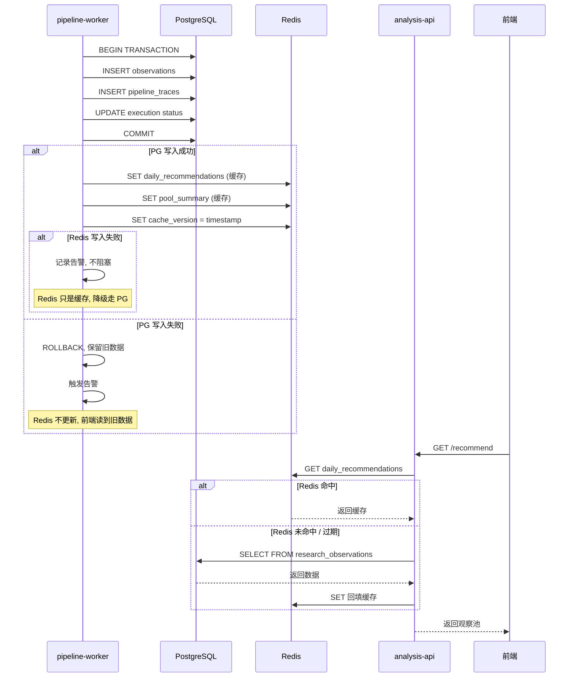

### 4.1 存储层封装

```python
# backend/services/analysis_service/storage/pool_storage.py

from sqlalchemy.ext.asyncio import AsyncSession
from redis.asyncio import Redis
import json
import logging

logger = logging.getLogger(__name__)


class PoolStorage:
    """观察池存储层 — PG 为主, Redis 为缓存"""

    def __init__(self, db_session: AsyncSession, redis: Redis):
        self.db = db_session
        self.redis = redis
        self.CACHE_TTL = 3600 * 24  # 24小时

    async def save_pool(self, observations: list[dict], ctx) -> bool:
        """
        事务写入 PG, 然后回填 Redis
        返回是否全部成功
        """
        # ---- PG 事务 ----
        async with self.db.begin():
            # 1. 软删除当天旧数据
            await self.db.execute(
                text("""
                    UPDATE research_observations
                    SET is_active = false, updated_at = now()
                    WHERE observation_date = :date AND is_active = true
                """),
                {"date": ctx.execution_date}
            )

            # 2. 写入新观察池
            for obs in observations:
                entity = ResearchObservation(**obs)
                self.db.add(entity)

            # 3. 写入管道追踪
            for step_name, traces in ctx.traces.items():
                for t in traces:
                    self.db.add(PipelineTrace(
                        execution_id=ctx.execution_id,
                        stock_code=t.stock_code,
                        stock_name=t.stock_name,
                        step_name=step_name,
                        action=t.action,
                        score_before=t.score_before,
                        score_after=t.score_after,
                        reason=t.reason,
                        detail=t.detail,
                    ))

            # 4. 更新执行记录
            await self.db.execute(
                text("""
                    UPDATE pipeline_executions
                    SET status = 'completed',
                        finished_at = now(),
                        total_output = :count,
                        step_summary = :summary
                    WHERE id = :exec_id
                """),
                {
                    "exec_id": ctx.execution_id,
                    "count": len(observations),
                    "summary": json.dumps(ctx.step_stats),
                }
            )
        # -- PG 事务结束, 到这里数据已持久化 --

        # ---- Redis 缓存回填 (允许失败) ----
        try:
            cache_data = {
                "observations": observations,
                "generated_at": ctx.started_at.isoformat(),
                "execution_id": ctx.execution_id,
                "version": int(datetime.now().timestamp()),
            }
            await self.redis.set(
                f"pool:daily:{ctx.execution_date}",
                json.dumps(cache_data, ensure_ascii=False),
                ex=self.CACHE_TTL,
            )

            # pool_summary
            summary = self._build_summary(observations, ctx)
            await self.redis.set(
                f"pool:summary:{ctx.execution_date}",
                json.dumps(summary, ensure_ascii=False),
                ex=self.CACHE_TTL,
            )

            logger.info(f"Redis cache updated for {ctx.execution_date}")

        except Exception as e:
            logger.warning(f"Redis cache update failed (non-critical): {e}")
            # 不抛出, 下次读取时走 PG fallback

        return True

    async def get_pool(self, date: str) -> dict | None:
        """读取观察池 — Redis 优先, PG 兜底"""

        # 1. 尝试 Redis
        try:
            cached = await self.redis.get(f"pool:daily:{date}")
            if cached:
                return json.loads(cached)
        except Exception as e:
            logger.warning(f"Redis read failed, falling back to PG: {e}")

        # 2. Fallback 到 PG
        result = await self.db.execute(
            text("""
                SELECT * FROM research_observations
                WHERE observation_date = :date AND is_active = true
                ORDER BY overall_score DESC
            """),
            {"date": date}
        )
        rows = result.fetchall()

        if not rows:
            return None

        observations = [dict(row._mapping) for row in rows]

        # 3. 回填 Redis (异步, 不等待)
        try:
            cache_data = {
                "observations": observations,
                "generated_at": None,
                "source": "pg_fallback",
            }
            await self.redis.set(
                f"pool:daily:{date}",
                json.dumps(cache_data, default=str, ensure_ascii=False),
                ex=self.CACHE_TTL,
            )
        except Exception:
            pass

        return {"observations": observations}
```

---

## 五、服务拆分方案

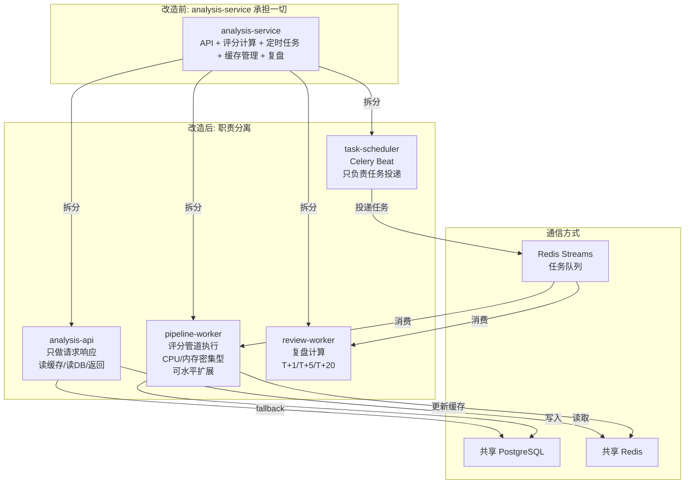

### 5.1 analysis-api 精简

```python
# backend/services/analysis_api/main.py

from fastapi import FastAPI, Depends, HTTPException
from .storage import PoolStorage
from .dependencies import get_pool_storage
from datetime import date

app = FastAPI(title="Analysis API", description="观察池读取接口")


@app.get("/api/v1/analysis/score/batch/recommend")
async def get_recommendations(
    target_date: str | None = None,
    force_refresh: bool = False,
    storage: PoolStorage = Depends(get_pool_storage),
):
    """
    获取观察池
    - 正常: 从 Redis/PG 读取
    - force_refresh: 投递重新生成任务, 返回旧数据 + 提示
    """
    if force_refresh:
        await _dispatch_refresh_task(target_date or date.today().isoformat())
        # 不等生成完成, 先返回旧数据

    dt = target_date or date.today().isoformat()
    pool = await storage.get_pool(dt)

    if not pool:
        raise HTTPException(404, "当天观察池尚未生成")

    return {
        "code": 200,
        "data": pool,
        "meta": {
            "generated_at": pool.get("generated_at"),
            "source": pool.get("source", "cache"),
            "refresh_pending": force_refresh,
        }
    }


@app.get("/api/v1/analysis/score/batch/intraday-confirmation")
async def get_intraday_confirmation(
    storage: PoolStorage = Depends(get_pool_storage),
):
    """
    盘中确认 — 在已有观察池基础上, 对比当前行情给出状态
    """
    pool = await storage.get_pool(date.today().isoformat())
    if not pool:
        raise HTTPException(404, "观察池未生成")

    # 获取行情快照 + 延迟标记
    market_data = await _get_market_snapshot(
        [obs["stock_code"] for obs in pool["observations"]]
    )

    confirmed = []
    for obs in pool["observations"]:
        code = obs["stock_code"]
        quote = market_data.get(code, {})

        status = _determine_intraday_status(obs, quote)
        confirmed.append({
            **obs,
            "intraday_status": status,
            "current_price": quote.get("price"),
            "quote_time": quote.get("time"),
            "quote_delay_seconds": quote.get("delay_seconds", 0),
        })

    return {
        "code": 200,
        "data": {
            "actionable": [c for c in confirmed if c["intraday_status"] == "actionable"],
            "wait_pullback": [c for c in confirmed if c["intraday_status"] == "wait_pullback"],
            "watch_only": [c for c in confirmed if c["intraday_status"] == "watch_only"],
            "invalidated": [c for c in confirmed if c["intraday_status"] == "invalidated"],
        },
        "meta": {
            "market_data_time": market_data.get("_snapshot_time"),
            "max_delay_seconds": max(
                (q.get("delay_seconds", 0) for q in market_data.values()
                 if isinstance(q, dict)), default=0
            ),
        }
    }
```

---

## 六、定时任务升级

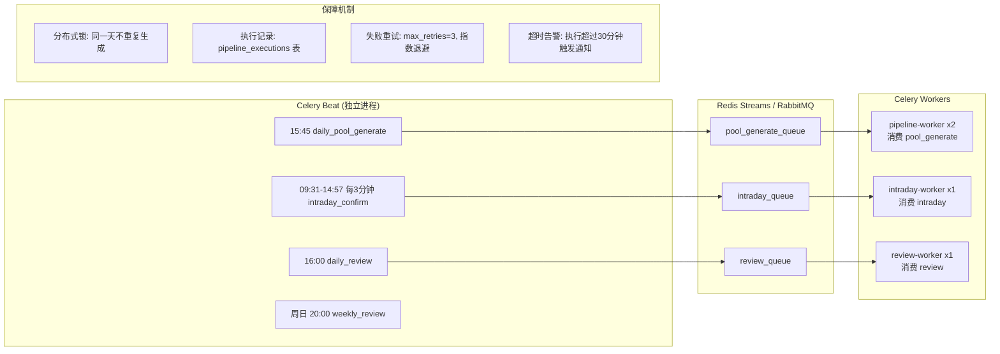

### 6.1 Celery 任务定义

```python
# backend/services/pipeline_worker/tasks.py

from celery import Celery
from celery.schedules import crontab
from redis import Redis
import logging

logger = logging.getLogger(__name__)

app = Celery("pipeline_worker")
app.config_from_object("pipeline_worker.celery_config")

# ---- 分布式锁 ----
redis_client = Redis.from_url(app.conf.broker_url)

def acquire_lock(lock_name: str, ttl: int = 3600) -> bool:
    """简单分布式锁, 防止多实例重复执行"""
    return redis_client.set(lock_name, "1", nx=True, ex=ttl)

def release_lock(lock_name: str):
    redis_client.delete(lock_name)


# ---- 定时配置 ----
app.conf.beat_schedule = {
    "daily-pool-generate": {
        "task": "pipeline_worker.tasks.generate_daily_pool",
        "schedule": crontab(hour=15, minute=45, day_of_week="1-5"),接着上面中断的地方继续。

---

## 六、定时任务升级（续）

### 6.1 Celery 任务定义（续）

```python
# backend/services/pipeline_worker/tasks.py（续）

app.conf.beat_schedule = {
    "daily-pool-generate": {
        "task": "pipeline_worker.tasks.generate_daily_pool",
        "schedule": crontab(hour=15, minute=45, day_of_week="1-5"),
        "options": {"queue": "pool_generate_queue"},
    },
    "intraday-confirmation": {
        "task": "pipeline_worker.tasks.intraday_confirm",
        "schedule": crontab(minute="*/3", hour="9-14", day_of_week="1-5"),
        "options": {"queue": "intraday_queue"},
    },
    "daily-review": {
        "task": "pipeline_worker.tasks.daily_review",
        "schedule": crontab(hour=16, minute=0, day_of_week="1-5"),
        "options": {"queue": "review_queue"},
    },
    "weekly-review": {
        "task": "pipeline_worker.tasks.weekly_review",
        "schedule": crontab(hour=20, minute=0, day_of_week="0"),
        "options": {"queue": "review_queue"},
    },
}


# ---- 任务实现 ----

@app.task(
    bind=True,
    max_retries=3,
    default_retry_delay=60,        # 首次重试等60秒
    retry_backoff=True,            # 指数退避
    retry_backoff_max=600,         # 最大退避10分钟
    soft_time_limit=1800,          # 软超时30分钟
    hard_time_limit=2100,          # 硬超时35分钟
    acks_late=True,                # 执行完才确认, 防崩溃丢任务
)
def generate_daily_pool(self, target_date: str = None, force: bool = False):
    """
    盘后生成观察池
    - 分布式锁防重复
    - 失败自动重试
    - 超时保护
    """
    from datetime import date as date_type
    target = target_date or date_type.today().isoformat()
    lock_key = f"lock:pool_generate:{target}"

    if not force and not acquire_lock(lock_key, ttl=3600):
        logger.warning(f"Pool generation for {target} already running, skip")
        return {"status": "skipped", "reason": "lock_held"}

    try:
        from .pipeline import DailyPoolPipeline
        pipeline = DailyPoolPipeline()

        result = pipeline.run_sync(
            trigger_type="force_refresh" if force else "scheduled"
        )

        logger.info(f"Pool generated: {len(result)} observations for {target}")
        return {
            "status": "completed",
            "date": target,
            "count": len(result),
        }

    except Exception as exc:
        logger.error(f"Pool generation failed: {exc}", exc_info=True)
        release_lock(lock_key)

        # 重试前检查: 是否值得重试
        if self.request.retries >= self.max_retries:
            _send_alert(f"观察池生成彻底失败: {target}, 错误: {exc}")
            raise

        raise self.retry(exc=exc)

    finally:
        # 成功后也释放锁 (让force_refresh能重新触发)
        if not self.request.retries:
            release_lock(lock_key)


@app.task(
    bind=True,
    max_retries=1,
    soft_time_limit=120,
    hard_time_limit=180,
)
def intraday_confirm(self):
    """
    盘中确认 — 每3分钟刷新一次状态
    """
    from datetime import date, datetime

    # 交易时间检查
    now = datetime.now()
    if not _is_trading_hours(now):
        return {"status": "skipped", "reason": "not_trading_hours"}

    try:
        from .intraday import IntradayConfirmation
        confirmer = IntradayConfirmation()
        result = confirmer.run_sync(date.today().isoformat())

        # 写入 Redis 供 API 层读取 (TTL 5分钟, 稍大于执行间隔)
        redis_client.set(
            f"intraday:confirmation:{date.today().isoformat()}",
            json.dumps(result, ensure_ascii=False, default=str),
            ex=300,
        )

        return {"status": "completed", "counts": {
            k: len(v) for k, v in result.items()
        }}

    except Exception as exc:
        logger.warning(f"Intraday confirmation failed: {exc}")
        raise self.retry(exc=exc)


@app.task(bind=True, max_retries=2, soft_time_limit=600)
def daily_review(self, target_date: str = None):
    """T+1 复盘"""
    try:
        from .review import ReviewEngine
        engine = ReviewEngine()
        result = engine.run_daily_review_sync(target_date)
        return {"status": "completed", "reviewed": len(result)}
    except Exception as exc:
        logger.error(f"Daily review failed: {exc}")
        raise self.retry(exc=exc)


@app.task(bind=True, max_retries=1, soft_time_limit=1200)
def weekly_review(self):
    """周度复盘 T+5"""
    try:
        from .review import ReviewEngine
        engine = ReviewEngine()
        result = engine.run_weekly_review_sync()
        return {"status": "completed", "reviewed": len(result)}
    except Exception as exc:
        logger.error(f"Weekly review failed: {exc}")
        raise self.retry(exc=exc)


# ---- 辅助函数 ----

def _is_trading_hours(now) -> bool:
    """判断是否在交易时间"""
    if now.weekday() >= 5:
        return False
    t = now.time()
    morning = time(9, 30) <= t <= time(11, 30)
    afternoon = time(13, 0) <= t <= time(15, 0)
    return morning or afternoon


def _send_alert(message: str):
    """发送告警 (可对接钉钉/企微/邮件)"""
    logger.critical(f"[ALERT] {message}")
    # TODO: 接入实际告警通道
```

---

## 七、LLM 调用治理

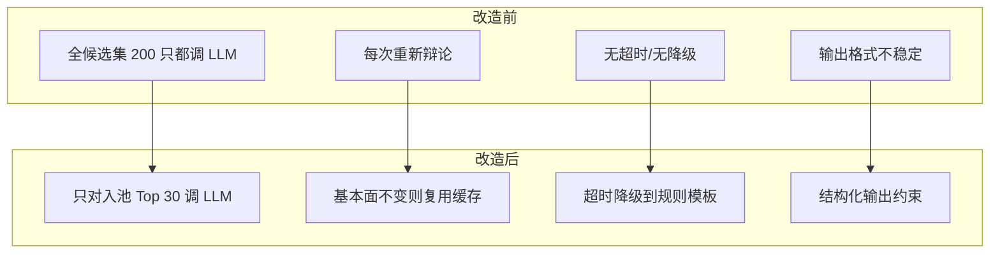

### 7.1 LLM 调用管理器

```python
# backend/services/pipeline_worker/llm_manager.py

from hashlib import md5
from redis.asyncio import Redis
import json
import asyncio
import logging

logger = logging.getLogger(__name__)


class LLMCallManager:
    """
    LLM 调用治理:
    1. 只在最终候选上调用, 不是全市场
    2. 内容摘要做 hash, 相同输入直接返回缓存
    3. 超时降级到规则模板
    4. 并发限制, 防止 API 限流
    """

    def __init__(
        self,
        redis: Redis,
        llm_client,                  # OpenAI / Anthropic client
        cache_ttl: int = 86400 * 3,  # 缓存3天
        call_timeout: int = 30,      # 单次调用30秒超时
        max_concurrent: int = 5,     # 最多并发5个请求
    ):
        self.redis = redis
        self.llm_client = llm_client
        self.cache_ttl = cache_ttl
        self.call_timeout = call_timeout
        self.semaphore = asyncio.Semaphore(max_concurrent)

    async def debate(self, stock: dict, context: dict) -> dict:
        """
        为单个标的生成多空辩论
        - 先查缓存
        - 缓存没有则调 LLM
        - LLM 超时则降级到规则模板
        """
        cache_key = self._build_cache_key(stock, context)

        # 1. 查缓存
        cached = await self._get_cache(cache_key)
        if cached:
            logger.debug(f"LLM cache hit: {stock['code']}")
            return {**cached, "_source": "cache"}

        # 2. 调 LLM (带超时 + 并发控制)
        try:
            async with self.semaphore:
                result = await asyncio.wait_for(
                    self._call_llm(stock, context),
                    timeout=self.call_timeout,
                )

            # 写缓存
            await self._set_cache(cache_key, result)
            return {**result, "_source": "llm"}

        except asyncio.TimeoutError:
            logger.warning(f"LLM timeout for {stock['code']}, fallback to template")
            return self._template_fallback(stock, context)

        except Exception as e:
            logger.warning(f"LLM error for {stock['code']}: {e}, fallback to template")
            return self._template_fallback(stock, context)

    async def batch_debate(self, stocks: list[dict], context: dict) -> list[dict]:
        """批量辩论, 并发但受限"""
        tasks = [self.debate(stock, context) for stock in stocks]
        return await asyncio.gather(*tasks, return_exceptions=False)

    def _build_cache_key(self, stock: dict, context: dict) -> str:
        """
        缓存键 = hash(股票代码 + 关键基本面数据 + 评分)
        基本面不变 → 同一个 key → 命中缓存
        """
        content = json.dumps({
            "code": stock["code"],
            "pe": stock.get("pe_ratio"),
            "pb": stock.get("pb_ratio"),
            "industry": stock.get("industry"),
            "revenue_growth": stock.get("revenue_growth"),
            "base_score": stock.get("base_score"),
            "category": stock.get("category"),
        }, sort_keys=True)

        content_hash = md5(content.encode()).hexdigest()[:12]
        return f"llm:debate:{stock['code']}:{content_hash}"

    async def _call_llm(self, stock: dict, context: dict) -> dict:
        """实际 LLM 调用, 要求结构化输出"""
        prompt = self._build_prompt(stock, context)

        response = await self.llm_client.chat.completions.create(
            model="gpt-4o-mini",  # 用小模型控制成本
            messages=[
                {"role": "system", "content": DEBATE_SYSTEM_PROMPT},
                {"role": "user", "content": prompt},
            ],
            response_format={"type": "json_object"},  # 强制 JSON 输出
            temperature=0.3,  # 低温度提高一致性
            max_tokens=800,
        )

        result = json.loads(response.choices[0].message.content)

        # 校验输出结构
        return self._validate_debate_output(result, stock["code"])

    def _template_fallback(self, stock: dict, context: dict) -> dict:
        """规则模板降级 — 不需要 LLM 也能产出基础辩论"""
        bull_reasons = []
        bear_reasons = []

        if stock.get("volume_ratio", 0) > 2:
            bull_reasons.append(f"量比{stock['volume_ratio']:.1f}显示资金关注度高")
        if stock.get("pe_ratio") and stock["pe_ratio"] < 20:
            bull_reasons.append(f"PE {stock['pe_ratio']:.1f}估值偏低")
        if stock.get("industry_heat", 0) > 70:
            bull_reasons.append(f"所在行业景气度{stock['industry_heat']}")

        if stock.get("change_pct", 0) > 5:
            bear_reasons.append(f"单日涨幅{stock['change_pct']:.1f}%存在追高风险")
        if stock.get("pe_ratio") and stock["pe_ratio"] > 50:
            bear_reasons.append(f"PE {stock['pe_ratio']:.1f}估值偏高")
        if stock.get("market_cap_rank", 0) > 2000:
            bear_reasons.append("市值偏小, 流动性风险")

        if not bull_reasons:
            bull_reasons.append("技术面信号触发观察条件")
        if not bear_reasons:
            bear_reasons.append("暂无明显利空, 需持续跟踪")

        return {
            "bull_case": bull_reasons,
            "bear_case": bear_reasons,
            "risk_veto": False,
            "confidence": "medium",
            "summary": f"{'、'.join(bull_reasons[:2])}; 风险点: {'、'.join(bear_reasons[:1])}",
            "_source": "template_fallback",
        }

    def _validate_debate_output(self, result: dict, code: str) -> dict:
        """校验 LLM 输出结构, 缺字段补默认"""
        required = ["bull_case", "bear_case", "risk_veto", "confidence", "summary"]
        for field in required:
            if field not in result:
                logger.warning(f"LLM output missing '{field}' for {code}")
                result[field] = {
                    "bull_case": ["数据不足"],
                    "bear_case": ["数据不足"],
                    "risk_veto": False,
                    "confidence": "low",
                    "summary": "LLM输出不完整",
                }.get(field)
        return result

    async def _get_cache(self, key: str) -> dict | None:
        try:
            data = await self.redis.get(key)
            return json.loads(data) if data else None
        except Exception:
            return None

    async def _set_cache(self, key: str, value: dict):
        try:
            await self.redis.set(key, json.dumps(value, ensure_ascii=False), ex=self.cache_ttl)
        except Exception as e:
            logger.debug(f"LLM cache write failed: {e}")


DEBATE_SYSTEM_PROMPT = """你是一个股票研究助手。对给定标的进行多空辩论分析。

必须返回如下 JSON 结构:
{
  "bull_case": ["看多理由1", "看多理由2", ...],
  "bear_case": ["看空理由1", "看空理由2", ...],
  "risk_veto": false,          // true 表示风险过大应否决
  "confidence": "high/medium/low",
  "summary": "一句话总结"
}

要求:
- 多空各至少2条理由
- 理由要具体, 带数据
- 保持客观, 不要无脑看多
- 如果风险明显过大, risk_veto 设为 true
"""
```

---

## 八、前端组件化拆分

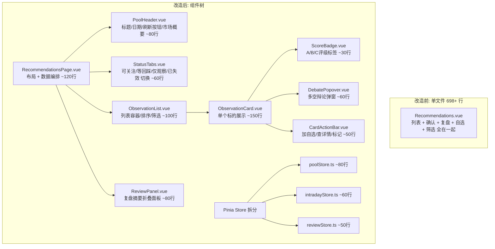

### 8.1 页面容器

```vue
<!-- frontend/web/src/views/RecommendationsPage.vue -->
<template>
  <div class="recommendations-page">
    <!-- 顶部: 池概要 + 刷新 -->
    <PoolHeader
      :summary="poolStore.summary"
      :loading="poolStore.loading"
      :last-update="poolStore.generatedAt"
      @refresh="handleRefresh"
    />

    <!-- 数据延迟警告 -->
    <MarketDelayWarning
      v-if="intradayStore.maxDelaySeconds > 30"
      :delay-seconds="intradayStore.maxDelaySeconds"
      :quote-time="intradayStore.snapshotTime"
    />

    <!-- 状态切换标签 -->
    <StatusTabs
      v-model="activeTab"
      :counts="intradayStore.statusCounts"
    />

    <!-- 观察池列表 -->
    <ObservationList
      :observations="currentObservations"
      :loading="poolStore.loading || intradayStore.loading"
      @add-watchlist="handleAddWatchlist"
      @view-detail="handleViewDetail"
    />

    <!-- 复盘面板 (可折叠) -->
    <ReviewPanel
      :reviews="reviewStore.recentReviews"
      :loading="reviewStore.loading"
    />
  </div>
</template>

<script setup lang="ts">
import { computed, onMounted, onUnmounted } from 'vue'
import { usePoolStore } from '@/stores/poolStore'
import { useIntradayStore } from '@/stores/intradayStore'
import { useReviewStore } from '@/stores/reviewStore'
import { useWatchlistActions } from '@/composables/useWatchlistActions'

import PoolHeader from '@/components/recommendations/PoolHeader.vue'
import MarketDelayWarning from '@/components/recommendations/MarketDelayWarning.vue'
import StatusTabs from '@/components/recommendations/StatusTabs.vue'
import ObservationList from '@/components/recommendations/ObservationList.vue'
import ReviewPanel from '@/components/recommendations/ReviewPanel.vue'

// ---- Store ----
const poolStore = usePoolStore()
const intradayStore = useIntradayStore()
const reviewStore = useReviewStore()
const { addToWatchlist } = useWatchlistActions()

// ---- 状态 ----
const activeTab = ref<'actionable' | 'wait_pullback' | 'watch_only' | 'invalidated'>('actionable')

const currentObservations = computed(() => {
  if (!intradayStore.hasData) {
    return poolStore.observations
  }
  return intradayStore.byStatus[activeTab.value] || []
})

// ---- 生命周期 ----
let intradayTimer: ReturnType<typeof setInterval> | null = null

onMounted(async () => {
  // 并行加载, 互不阻塞
  await Promise.allSettled([
    poolStore.fetchPool(),
    intradayStore.fetchConfirmation(),
    reviewStore.fetchRecent(),
  ])

  // 盘中每60秒刷新确认状态
  if (isTradingHours()) {
    intradayTimer = setInterval(() => {
      intradayStore.fetchConfirmation()
    }, 60_000)
  }
})

onUnmounted(() => {
  if (intradayTimer) clearInterval(intradayTimer)
})

// ---- 操作 ----
async function handleRefresh() {
  await poolStore.fetchPool(true)
}

async function handleAddWatchlist(stock: { code: string; name: string }) {
  await addToWatchlist(stock)
}

function handleViewDetail(code: string) {
  // 路由跳转到标的详情
}

function isTradingHours(): boolean {
  const now = new Date()
  const h = now.getHours()
  const m = now.getMinutes()
  const day = now.getDay()
  if (day === 0 || day === 6) return false
  const t = h * 60 + m
  return (t >= 570 && t <= 690) || (t >= 780 && t <= 900)
}
</script>
```

### 8.2 Pinia Store 拆分

```typescript
// frontend/web/src/stores/poolStore.ts

import { defineStore } from 'pinia'
import { ref, computed } from 'vue'
import { analysisApi } from '@/api/analysis'

export interface Observation {
  stock_code: string
  stock_name: string
  overall_score: number
  grade: 'A' | 'B' | 'C'
  category: 'trend_strong' | 'pullback_buy' | 'oversold_bounce'
  bull_case: string[]
  bear_case: string[]
  next_action: string
  trigger_condition: string
  invalidation_condition: string
  risk_notes: string
}

export interface PoolSummary {
  total_count: number
  grade_distribution: Record<string, number>
  category_distribution: Record<string, number>
  market_sentiment: string
  generated_at: string
}

export const usePoolStore = defineStore('pool', () => {
  // ---- 状态 ----
  const observations = ref<Observation[]>([])
  const summary = ref<PoolSummary | null>(null)
  const loading = ref(false)
  const error = ref<string | null>(null)
  const generatedAt = ref<string | null>(null)
  const source = ref<string>('unknown')

  // ---- 计算属性 ----
  const gradeA = computed(() => observations.value.filter(o => o.grade === 'A'))
  const gradeB = computed(() => observations.value.filter(o => o.grade === 'B'))
  const gradeC = computed(() => observations.value.filter(o => o.grade === 'C'))
  const isEmpty = computed(() => observations.value.length === 0 && !loading.value)

  // ---- 操作 ----
  async function fetchPool(forceRefresh = false) {
    loading.value = true
    error.value = null

    try {
      const res = await analysisApi.getRecommendations({ force_refresh: forceRefresh })

      observations.value = res.data.observations || []
      summary.value = res.data.pool_summary || null
      generatedAt.value = res.meta?.generated_at || null
      source.value = res.meta?.source || 'cache'

      if (forceRefresh && res.meta?.refresh_pending) {
        // 正在重新生成, 当前数据是旧的, 稍后轮询
        setTimeout(() => fetchPool(false), 30_000)
      }
    } catch (e: any) {
      error.value = e.message || '获取观察池失败'
      // 不清空旧数据, 让用户至少能看到上次结果
    } finally {
      loading.value = false
    }
  }

  function $reset() {
    observations.value = []
    summary.value = null
    loading.value = false
    error.value = null
  }

  return {
    observations, summary, loading, error, generatedAt, source,
    gradeA, gradeB, gradeC, isEmpty,
    fetchPool, $reset,
  }
})
```

```typescript
// frontend/web/src/stores/intradayStore.ts

import { defineStore } from 'pinia'
import { ref, computed } from 'vue'
import { analysisApi } from '@/api/analysis'

interface IntradayObservation {
  stock_code: string
  stock_name: string
  intraday_status: 'actionable' | 'wait_pullback' | 'watch_only' | 'invalidated'
  current_price: number | null
  quote_time: string | null
  quote_delay_seconds: number
  // ... 继承 Observation 的其他字段
}

export const useIntradayStore = defineStore('intraday', () => {
  const data = ref<Record<string, IntradayObservation[]>>({
    actionable: [],
    wait_pullback: [],
    watch_only: [],
    invalidated: [],
  })
  const loading = ref(false)
  const snapshotTime = ref<string | null>(null)
  const maxDelaySeconds = ref(0)

  const hasData = computed(() =>
    Object.values(data.value).some(list => list.length > 0)
  )

  const statusCounts = computed(() => ({
    actionable: data.value.actionable.length,
    wait_pullback: data.value.wait_pullback.length,
    watch_only: data.value.watch_only.length,
    invalidated: data.value.invalidated.length,
  }))

  const byStatus = computed(() => data.value)

  async function fetchConfirmation() {
    loading.value = true
    try {
      const res = await analysisApi.getIntradayConfirmation()

      data.value = {
        actionable: res.data.actionable || [],
        wait_pullback: res.data.wait_pullback || [],
        watch_only: res.data.watch_only || [],
        invalidated: res.data.invalidated || [],
      }
      snapshotTime.value = res.meta?.market_data_time || null
      maxDelaySeconds.value = res.meta?.max_delay_seconds || 0

    } catch (e) {
      // 盘中确认失败不清空旧数据
      console.warn('Intraday confirmation failed:', e)
    } finally {
      loading.value = false
    }
  }

  return {
    data, loading, snapshotTime, maxDelaySeconds,
    hasData, statusCounts, byStatus,
    fetchConfirmation,
  }
})
```

### 8.3 行情延迟警告组件

```vue
<!-- frontend/web/src/components/recommendations/MarketDelayWarning.vue -->
<template>
  <el-alert
    type="warning"
    :closable="false"
    show-icon
    class="delay-warning"
  >
    <template #title>
      行情数据延迟 {{ delaySeconds }}秒
    </template>
    <template #default>
      数据快照时间: {{ formatTime(quoteTime) }}。
      盘中确认状态可能不反映最新价格, 请结合实盘行情判断。
    </template>
  </el-alert>
</template>

<script setup lang="ts">
defineProps<{
  delaySeconds: number
  quoteTime: string | null
}>()

function formatTime(t: string | null): string {
  if (!t) return '未知'
  return new Date(t).toLocaleTimeString('zh-CN')
}
</script>
```

---

## 九、容错与降级

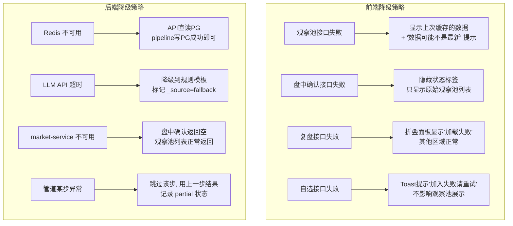

### 9.1 前端请求封装（带降级）

```typescript
// frontend/web/src/api/analysis.ts — 改造

import axios, { type AxiosError } from 'axios'
import { ElMessage } from 'element接着上面中断的地方继续。

### 9.1 前端请求封装（带降级）

```typescript
// frontend/web/src/api/analysis.ts — 改造

import axios, { type AxiosError } from 'axios'
import { ElMessage } from 'element-plus'

const client = axios.create({
  baseURL: '/api/v1/analysis',
  timeout: 15000,
})

// ---- 本地降级缓存 ----
const LOCAL_CACHE_KEY = 'pool_local_cache'

function getLocalCache(key: string): any | null {
  try {
    const raw = localStorage.getItem(`${LOCAL_CACHE_KEY}:${key}`)
    if (!raw) return null
    const { data, timestamp } = JSON.parse(raw)
    // 本地缓存最多保留24小时
    if (Date.now() - timestamp > 86400_000) {
      localStorage.removeItem(`${LOCAL_CACHE_KEY}:${key}`)
      return null
    }
    return data
  } catch {
    return null
  }
}

function setLocalCache(key: string, data: any) {
  try {
    localStorage.setItem(`${LOCAL_CACHE_KEY}:${key}`, JSON.stringify({
      data,
      timestamp: Date.now(),
    }))
  } catch {
    // localStorage 满了就算了
  }
}


// ---- API 方法 ----

export const analysisApi = {

  /**
   * 获取观察池
   * 降级链: 服务端Redis → 服务端PG → 前端localStorage
   */
  async getRecommendations(params?: { force_refresh?: boolean }) {
    try {
      const res = await client.get('/score/batch/recommend', { params })
      const result = res.data

      // 成功后写入本地缓存作为兜底
      setLocalCache('recommendations', result)

      return result

    } catch (error) {
      const axiosErr = error as AxiosError

      // 网络错误或服务端500, 尝试本地缓存
      const cached = getLocalCache('recommendations')
      if (cached) {
        ElMessage.warning({
          message: '服务暂时不可用, 显示的是缓存数据',
          duration: 5000,
        })
        return {
          ...cached,
          meta: {
            ...cached.meta,
            source: 'local_cache',
            stale: true,
          },
        }
      }

      // 本地缓存也没有, 抛出
      throw error
    }
  },

  /**
   * 获取盘中确认
   * 失败不抛出, 返回空结构, 让页面降级到纯观察池模式
   */
  async getIntradayConfirmation() {
    try {
      const res = await client.get('/score/batch/intraday-confirmation', {
        timeout: 10000, // 盘中接口给更短超时
      })
      return res.data
    } catch (error) {
      console.warn('Intraday confirmation unavailable:', error)
      // 返回空结构而不是抛错
      return {
        code: 200,
        data: {
          actionable: [],
          wait_pullback: [],
          watch_only: [],
          invalidated: [],
        },
        meta: {
          market_data_time: null,
          max_delay_seconds: 0,
          unavailable: true,
          unavailable_reason: (error as AxiosError).message,
        },
      }
    }
  },

  /**
   * 获取复盘摘要
   * 失败静默, 复盘是锦上添花不是核心功能
   */
  async getRecentReviews() {
    try {
      const res = await client.get('/reviews/recent', {
        timeout: 8000,
      })
      return res.data
    } catch (error) {
      console.warn('Reviews unavailable:', error)
      return {
        code: 200,
        data: [],
        meta: { unavailable: true },
      }
    }
  },

  /**
   * 获取管道执行详情 (调试用)
   */
  async getPipelineTrace(executionId: string) {
    const res = await client.get(`/pipeline/trace/${executionId}`)
    return res.data
  },
}
```

### 9.2 后端管道容错 — 步骤级降级

```python
# backend/services/pipeline_worker/pipeline_runner.py

import logging
from typing import Callable, Any
from .pipeline_tracker import PipelineContext

logger = logging.getLogger(__name__)


class ResilientPipelineRunner:
    """
    弹性管道执行器
    - 每步独立 try/catch
    - 可配置哪些步骤失败允许跳过
    - 记录 partial 状态
    """

    # 步骤配置: (函数, 步骤名, 是否必须)
    # required=True 的步骤失败会终止整条管道
    # required=False 的步骤失败会跳过, 用上一步结果继续
    STEP_CONFIG = [
        {"name": "collect_snapshots",  "required": True},
        {"name": "screen_anomalies",   "required": True},
        {"name": "industry_filter",    "required": False},  # 行业数据没拿到可以跳
        {"name": "hard_veto",          "required": True},
        {"name": "base_scoring",       "required": True},
        {"name": "multiply_scoring",   "required": True},
        {"name": "category_balance",   "required": False},  # 均衡失败退化为不均衡
        {"name": "chase_penalty",      "required": False},  # 追高惩罚失败退化为不惩罚
        {"name": "evidence_debate",    "required": False},  # LLM失败用模板
        {"name": "abc_layering",       "required": True},
        {"name": "generate_actions",   "required": True},
        {"name": "secondary_optimize", "required": False},  # 二次优化失败用一次结果
    ]

    def __init__(self, pipeline):
        self.pipeline = pipeline

    async def run(self, ctx: PipelineContext) -> tuple[list, str]:
        """
        执行管道, 返回 (结果列表, 状态)
        状态: completed / partial / failed
        """
        current_data = None
        skipped_steps = []
        failed_step = None

        for step_cfg in self.STEP_CONFIG:
            step_name = step_cfg["name"]
            required = step_cfg["required"]
            step_fn: Callable = getattr(self.pipeline, step_name)

            try:
                if current_data is None:
                    # 第一步, 无输入
                    current_data = await step_fn(ctx=ctx)
                else:
                    current_data = await step_fn(current_data, ctx=ctx)

                logger.info(f"Step '{step_name}' completed: {len(current_data)} items")

            except Exception as e:
                logger.error(f"Step '{step_name}' failed: {e}", exc_info=True)

                if required:
                    # 必须步骤失败 → 终止
                    failed_step = step_name
                    ctx.add_step_stats(step_name,
                        len(current_data) if current_data else 0, 0, 0)
                    break
                else:
                    # 可选步骤失败 → 跳过, 用上一步数据继续
                    skipped_steps.append(step_name)
                    logger.warning(
                        f"Step '{step_name}' skipped (non-required), "
                        f"continuing with {len(current_data)} items"
                    )
                    ctx.add_step_stats(step_name,
                        len(current_data) if current_data else 0,
                        len(current_data) if current_data else 0,
                        0)
                    continue

        # 判定最终状态
        if failed_step:
            status = "failed"
            logger.error(f"Pipeline failed at required step: {failed_step}")
        elif skipped_steps:
            status = "partial"
            logger.warning(f"Pipeline partial, skipped: {skipped_steps}")
        else:
            status = "completed"

        return current_data or [], status, skipped_steps
```

---

## 十、可解释性增强

### 10.1 标的入选理由生成

```python
# backend/services/pipeline_worker/explainer.py

class ObservationExplainer:
    """
    为每个入池标的生成人类可读的入选理由
    不依赖 LLM, 纯规则拼装
    """

    def generate_reason(self, stock: dict, trace_data: dict) -> dict:
        """
        输入: 标的数据 + 管道追踪数据
        输出: 结构化的入选理由
        """
        primary_reasons = []
        secondary_reasons = []
        risk_warnings = []

        # ---- 主要理由 (为什么关注) ----
        category = stock.get("category", "")

        if category == "trend_strong":
            primary_reasons.append(
                f"趋势强势: {stock.get('trend_description', '均线多头排列')}"
            )
            if stock.get("volume_ratio", 0) > 1.5:
                primary_reasons.append(
                    f"放量确认: 量比{stock['volume_ratio']:.1f}"
                )

        elif category == "pullback_buy":
            primary_reasons.append(
                f"强势回调: 从高点回撤{stock.get('pullback_pct', 0):.1f}%至支撑位"
            )
            if stock.get("support_level"):
                primary_reasons.append(
                    f"关键支撑: {stock['support_level']:.2f}"
                )

        elif category == "oversold_bounce":
            primary_reasons.append(
                f"超跌反弹: RSI={stock.get('rsi', 0):.0f}, "
                f"乖离率={stock.get('bias', 0):.1f}%"
            )

        # ---- 加分项 ----
        if stock.get("industry_heat", 0) > 70:
            secondary_reasons.append(
                f"行业景气: {stock.get('industry_name', '')}景气度{stock['industry_heat']}"
            )

        if stock.get("pe_ratio") and stock["pe_ratio"] < 25:
            secondary_reasons.append(
                f"估值合理: PE {stock['pe_ratio']:.1f}"
            )

        if stock.get("revenue_growth", 0) > 15:
            secondary_reasons.append(
                f"业绩增长: 营收同比+{stock['revenue_growth']:.0f}%"
            )

        # ---- 风险提示 ----
        if stock.get("change_pct", 0) > 5:
            risk_warnings.append(
                f"短期涨幅较大({stock['change_pct']:.1f}%), 注意追高风险"
            )

        if stock.get("market_cap", 0) < 5_000_000_000:
            risk_warnings.append("小市值标的, 流动性可能不足")

        if stock.get("debate_confidence") == "low":
            risk_warnings.append("多空分歧较大, 确定性偏低")

        # ---- 一句话摘要 ----
        summary = self._build_summary(primary_reasons, risk_warnings, stock)

        return {
            "primary_reasons": primary_reasons[:3],
            "secondary_reasons": secondary_reasons[:3],
            "risk_warnings": risk_warnings[:3],
            "summary": summary,
            "category_label": {
                "trend_strong": "趋势强势",
                "pullback_buy": "回调承接",
                "oversold_bounce": "超跌反弹",
            }.get(category, "其他"),
        }

    def _build_summary(self, reasons: list, risks: list, stock: dict) -> str:
        """一句话: 为什么关注 + 最大风险"""
        why = reasons[0] if reasons else "综合评分靠前"
        risk = risks[0] if risks else "暂无突出风险"
        grade = stock.get("grade", "")

        return f"[{grade}级] {why}。提示: {risk}"
```

### 10.2 前端展示入选理由

```vue
<!-- frontend/web/src/components/recommendations/ObservationCard.vue -->
<template>
  <el-card class="observation-card" :class="`grade-${observation.grade?.toLowerCase()}`">
    <!-- 头部: 名称 + 评级 -->
    <div class="card-header">
      <div class="stock-info">
        <span class="stock-name">{{ observation.stock_name }}</span>
        <span class="stock-code">{{ observation.stock_code }}</span>
        <ScoreBadge :grade="observation.grade" />
        <el-tag size="small" :type="categoryTagType">
          {{ observation.explain?.category_label || observation.category }}
        </el-tag>
      </div>
      <div class="score">
        {{ observation.overall_score?.toFixed(1) }}分
      </div>
    </div>

    <!-- 一句话摘要 — 最重要的信息 -->
    <div class="summary">
      {{ observation.explain?.summary || '暂无摘要' }}
    </div>

    <!-- 入选理由 (默认折叠) -->
    <el-collapse v-model="expandedSections">
      <el-collapse-item title="入选理由" name="reasons">
        <div class="reason-section">
          <div class="reason-group">
            <span class="label">主要理由</span>
            <ul>
              <li v-for="r in observation.explain?.primary_reasons" :key="r">
                {{ r }}
              </li>
            </ul>
          </div>
          <div v-if="observation.explain?.secondary_reasons?.length" class="reason-group">
            <span class="label">加分项</span>
            <ul>
              <li v-for="r in observation.explain?.secondary_reasons" :key="r">
                {{ r }}
              </li>
            </ul>
          </div>
          <div v-if="observation.explain?.risk_warnings?.length" class="reason-group risk">
            <span class="label">风险提示</span>
            <ul>
              <li v-for="r in observation.explain?.risk_warnings" :key="r">
                ⚠️ {{ r }}
              </li>
            </ul>
          </div>
        </div>
      </el-collapse-item>

      <!-- 多空辩论 -->
      <el-collapse-item title="多空辩论" name="debate">
        <div class="debate-section">
          <div class="bull">
            <span class="label bull-label">🟢 看多</span>
            <ul>
              <li v-for="r in observation.bull_case" :key="r">{{ r }}</li>
            </ul>
          </div>
          <div class="bear">
            <span class="label bear-label">🔴 看空</span>
            <ul>
              <li v-for="r in observation.bear_case" :key="r">{{ r }}</li>
            </ul>
          </div>
          <el-tag
            v-if="observation.debate_source === 'template_fallback'"
            size="small" type="info"
          >
            规则生成 (LLM不可用)
          </el-tag>
        </div>
      </el-collapse-item>
    </el-collapse>

    <!-- 观察动作 -->
    <div class="action-guidance">
      <div class="action-item">
        <span class="label">下一步</span>
        <span>{{ observation.next_action }}</span>
      </div>
      <div class="action-item">
        <span class="label">触发条件</span>
        <span>{{ observation.trigger_condition }}</span>
      </div>
      <div class="action-item">
        <span class="label">失效条件</span>
        <span class="invalidation">{{ observation.invalidation_condition }}</span>
      </div>
    </div>

    <!-- 盘中状态 -->
    <div v-if="observation.intraday_status" class="intraday-status">
      <el-tag :type="intradayTagType" effect="dark" size="small">
        {{ intradayLabel }}
      </el-tag>
      <span v-if="observation.current_price" class="current-price">
        现价 {{ observation.current_price.toFixed(2) }}
      </span>
      <span
        v-if="observation.quote_delay_seconds > 30"
        class="delay-hint"
      >
        (延迟{{ observation.quote_delay_seconds }}秒)
      </span>
    </div>

    <!-- 底部操作 -->
    <CardActionBar
      :stock-code="observation.stock_code"
      :stock-name="observation.stock_name"
      @add-watchlist="$emit('add-watchlist', $event)"
      @view-detail="$emit('view-detail', observation.stock_code)"
    />
  </el-card>
</template>

<script setup lang="ts">
import { ref, computed } from 'vue'
import ScoreBadge from './ScoreBadge.vue'
import CardActionBar from './CardActionBar.vue'

const props = defineProps<{
  observation: any
}>()

defineEmits<{
  'add-watchlist': [payload: { code: string; name: string }]
  'view-detail': [code: string]
}>()

const expandedSections = ref<string[]>([])

const categoryTagType = computed(() => {
  const map: Record<string, string> = {
    trend_strong: '',
    pullback_buy: 'warning',
    oversold_bounce: 'danger',
  }
  return map[props.observation.category] || 'info'
})

const intradayTagType = computed(() => {
  const map: Record<string, string> = {
    actionable: 'success',
    wait_pullback: 'warning',
    watch_only: 'info',
    invalidated: 'danger',
  }
  return map[props.observation.intraday_status] || 'info'
})

const intradayLabel = computed(() => {
  const map: Record<string, string> = {
    actionable: '可关注',
    wait_pullback: '等回踩',
    watch_only: '仅观察',
    invalidated: '已失效',
  }
  return map[props.observation.intraday_status] || '未知'
})
</script>

<style scoped>
.observation-card {
  margin-bottom: 12px;
  border-left: 4px solid var(--el-color-info);
}
.observation-card.grade-a {
  border-left-color: var(--el-color-success);
}
.observation-card.grade-b {
  border-left-color: var(--el-color-warning);
}
.observation-card.grade-c {
  border-left-color: var(--el-color-info);
}

.card-header {
  display: flex;
  justify-content: space-between;
  align-items: center;
  margin-bottom: 8px;
}
.stock-name {
  font-weight: 600;
  font-size: 16px;
  margin-right: 8px;
}
.stock-code {
  color: var(--el-text-color-secondary);
  margin-right: 8px;
}
.score {
  font-size: 20px;
  font-weight: 700;
  color: var(--el-color-primary);
}

.summary {
  padding: 8px 12px;
  background: var(--el-fill-color-lighter);
  border-radius: 4px;
  margin-bottom: 12px;
  font-size: 14px;
  line-height: 1.6;
}

.reason-group {
  margin-bottom: 8px;
}
.reason-group .label {
  font-weight: 600;
  font-size: 13px;
}
.reason-group.risk .label {
  color: var(--el-color-danger);
}
.reason-group ul {
  margin: 4px 0 0 16px;
  padding: 0;
}
.reason-group li {
  font-size: 13px;
  line-height: 1.8;
}

.bull-label { color: var(--el-color-success); }
.bear-label { color: var(--el-color-danger); }

.action-guidance {
  display: grid;
  grid-template-columns: repeat(3, 1fr);
  gap: 8px;
  margin: 12px 0;
  padding: 8px;
  background: var(--el-fill-color-lighter);
  border-radius: 4px;
  font-size: 13px;
}
.action-item .label {
  display: block;
  font-weight: 600;
  font-size: 12px;
  color: var(--el-text-color-secondary);
  margin-bottom: 2px;
}
.invalidation {
  color: var(--el-color-danger);
}

.intraday-status {
  display: flex;
  align-items: center;
  gap: 8px;
  margin-bottom: 8px;
}
.delay-hint {
  font-size: 12px;
  color: var(--el-color-warning);
}
</style>
```

---

## 十一、监控与告警

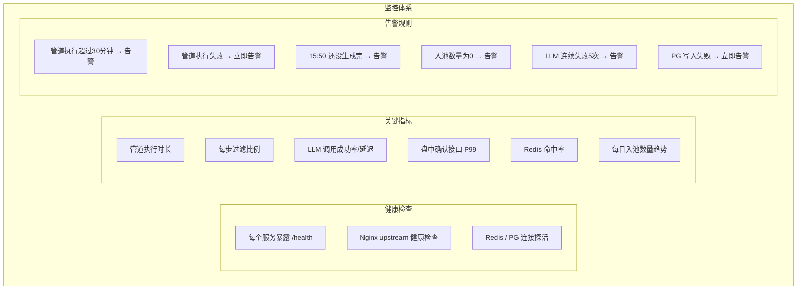

### 11.1 健康检查端点

```python
# backend/services/analysis_api/health.py

from fastapi import APIRouter, Depends
from redis.asyncio import Redis
from sqlalchemy.ext.asyncio import AsyncSession
from datetime import date, datetime

router = APIRouter(tags=["health"])


@router.get("/health")
async def health_check(
    db: AsyncSession = Depends(get_db),
    redis: Redis = Depends(get_redis),
):
    """综合健康检查"""
    checks = {}

    # 1. PG
    try:
        result = await db.execute(text("SELECT 1"))
        checks["postgresql"] = {"status": "ok"}
    except Exception as e:
        checks["postgresql"] = {"status": "error", "detail": str(e)}

    # 2. Redis
    try:
        pong = await redis.ping()
        checks["redis"] = {"status": "ok" if pong else "error"}
    except Exception as e:
        checks["redis"] = {"status": "error", "detail": str(e)}

    # 3. 今日观察池是否已生成
    try:
        pool = await redis.get(f"pool:daily:{date.today().isoformat()}")
        checks["today_pool"] = {
            "status": "ok" if pool else "not_generated",
            "generated": pool is not None,
        }
    except Exception:
        checks["today_pool"] = {"status": "unknown"}

    # 4. 最近一次管道执行
    try:
        result = await db.execute(
            text("""
                SELECT status, started_at, finished_at, total_output
                FROM pipeline_executions
                ORDER BY started_at DESC LIMIT 1
            """)
        )
        row = result.fetchone()
        if row:
            checks["last_pipeline"] = {
                "status": row.status,
                "started_at": row.started_at.isoformat() if row.started_at else None,
                "finished_at": row.finished_at.isoformat() if row.finished_at else None,
                "output_count": row.total_output,
            }
    except Exception:
        checks["last_pipeline"] = {"status": "unknown"}

    overall = "healthy" if all(
        c.get("status") == "ok" for c in checks.values()
    ) else "degraded"

    return {
        "status": overall,
        "timestamp": datetime.now().isoformat(),
        "checks": checks,
    }


@router.get("/health/pipeline/stats")
async def pipeline_stats(
    days: int = 7,
    db: AsyncSession = Depends(get_db),
):
    """最近N天管道执行统计"""
    result = await db.execute(
        text("""
            SELECT
                execution_date,
                status,
                total_input,
                total_output,
                EXTRACT(EPOCH FROM (finished_at - started_at)) as duration_seconds,
                step_summary
            FROM pipeline_executions
            WHERE execution_date >= CURRENT_DATE - :days
            ORDER BY execution_date DESC
        """),
        {"days": days}
    )

    rows = result.fetchall()
    return {
        "stats": [
            {
                "date": row.execution_date.isoformat(),
                "status": row.status,
                "input": row.total_input,
                "output": row.total_output,
                "duration_seconds": round(row.duration_seconds, 1) if row.duration_seconds else None,
                "steps": row.step_summary,
            }
            for row in rows
        ]
    }
```

---

## 十二、优化实施路线图

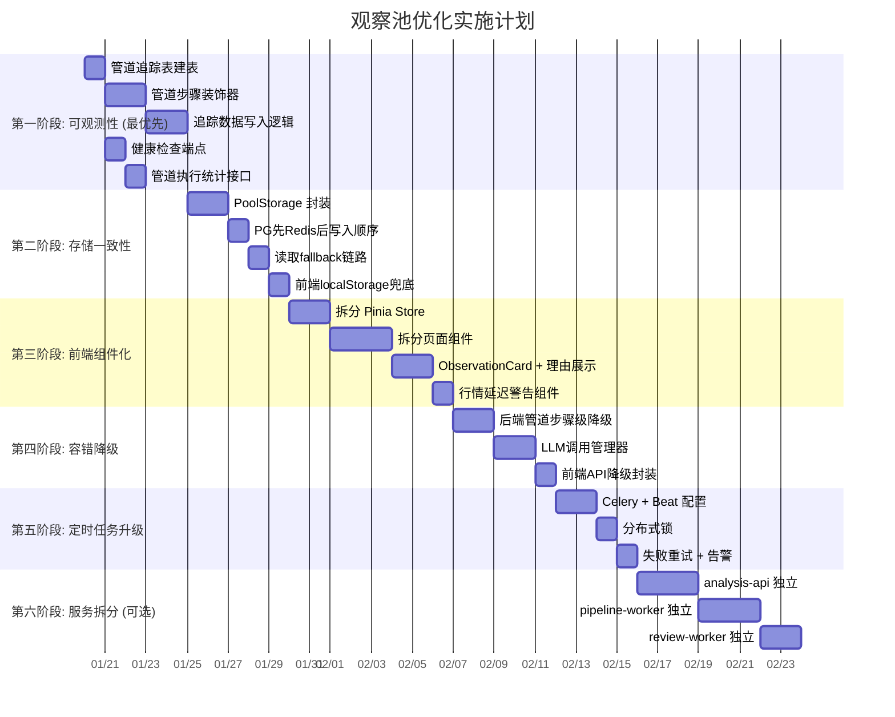

---

## 十三、优化前后对比

| 维度 | 改造前 | 改造后 |
|------|--------|--------|
| **管道可观测** | 只有最终结果, 不知道中间发生了什么 | 每步有追踪记录, 可查任意标的在哪步被过滤及原因 |
| **存储一致性** | Redis 和 PG 各写各的, 崩溃可能不一致 | PG 事务优先, Redis 降级为缓存, 有 fallback 链 |
| **前端结构** | 698+ 行单文件, 改一个功能怕影响其他 | 按职责拆 8 个组件 + 3 个 Store, 可独立开发测试 |
| **定时任务** | 进程内定时器, 重启丢任务 | Celery Beat + 分布式锁 + 重试 + 告警 |
| **LLM 调用** | 全候选集调用, 无缓存无超时 | Top N 调用 + 内容 hash 缓存 + 超时降级到模板 |
| **用户理解** | 给一个分数, 不知道为什么 | 一句话摘要 + 入选理由 + 多空辩论
